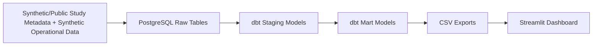

# RheumTrialOps

Clinical Research Operations Analytics for Rheumatology Studies

## Project Overview

RheumTrialOps is a lightweight clinical research operations analytics prototype built with public or synthetic rheumatology study metadata and fully synthetic operational data. It tracks study portfolio status, subject accrual, grant/JIT activity, study milestones, data quality validation, and rule-based operational risk scoring.

The project is organized around rheumatology and chronic disease research themes such as rheumatoid arthritis, gout, osteoporosis, lupus, inflammatory arthritis, telemedicine follow-up, technology-enabled care delivery, infection prevention, polypharmacy monitoring, and chronic inflammatory disease.

## Why This Project Was Built

This project was built to demonstrate how healthcare data engineering, reporting, SQL modeling, validation, and dashboarding skills can translate into clinical research operations workflows.

It emphasizes transferable skills: SQL modeling, dbt transformations, data validation, dashboarding, study accrual tracking, grant/JIT visibility, milestone monitoring, and operational risk scoring.

## Architecture



## Data Model

Source tables:

- `studies`: synthetic protocol and portfolio metadata.
- `subjects`: synthetic screening, enrollment, eligibility, and disposition records.
- `grants`: synthetic sponsor, submission, award, funding, and JIT records.
- `milestones`: synthetic study timeline and milestone records.

Main mart outputs:

- `research_portfolio_summary`: one row per study with portfolio, accrual, funding, milestone, and quality metrics.
- `subject_accrual`: monthly subject accrual by study and study arm.
- `grant_jit_tracking`: grant status, funding, award, and JIT tracking.
- `milestone_delay_summary`: milestone delay and risk tracking.
- `data_quality_summary`: one row per failed validation rule.
- `study_risk_score`: transparent rule-based operational risk score by study.

## Dashboard Pages

- **Research Portfolio Overview**: portfolio KPIs, study status, condition areas, funding, risk distribution, and operational takeaway text.
- **Subject Accrual & Study Progress**: screening and enrollment KPIs, accrual trends, study-arm enrollment, and studies below accrual target.
- **Grants, Milestones & Data Quality**: grant/JIT tracking, funding by sponsor, delayed milestones, high-severity quality issues, and high-risk study tables.

## Data Quality Rules

Example validation rules include:

- Enrollment date before screening date.
- Enrolled subject marked ineligible.
- Withdrawn subject missing withdrawal reason.
- Target completion date before activation date.
- Funding amount below zero.
- JIT required but missing or invalid JIT status.
- Completed milestone missing actual date.

Intentional bad records are preserved so the dashboard can show validation and monitoring workflows.

## Rule-Based Risk Score

This is a transparent operational risk score using accrual progress, pending JIT items, delayed milestones, high-severity data quality issues, and approaching completion timelines. It is intended for operational review, not clinical prediction.

## Clinical Research Platform Mapping

| Workflow Concept | RheumTrialOps Prototype Mapping |
| --- | --- |
| REDCap-style data capture | Synthetic subject/enrollment records |
| OnCore/CTMS-style study tracking | Study status, milestones, accrual, risk score |
| HURON-style research administration | Grant status, JIT tracking, funding visibility |
| Investigator reporting | Streamlit dashboard pages |
| Data quality oversight | dbt tests and validation summary |

## Tech Stack

- Python
- PostgreSQL
- dbt
- Streamlit
- pandas
- Plotly
- SQL

## What This Project Does Not Claim

"This project does not use real patient data, real UAB data, or direct access to REDCap, OnCore, HURON, PowerTrials, or CTMS systems. It uses public or synthetic study metadata and fully synthetic operational data to demonstrate transferable data modeling, validation, workflow monitoring, and reporting skills for clinical research operations."

## How to Run Locally

Install dependencies:

```powershell
pip install -r requirements.txt
pip install sqlalchemy psycopg2-binary dbt-postgres
```

Generate synthetic raw data:

```powershell
python src/generate_data.py
```

Create PostgreSQL schemas and raw tables, then load CSVs:

```powershell
psql -U postgres -d rheumtrialops -f sql/01_create_schema.sql
psql -U postgres -d rheumtrialops -f sql/02_create_raw_tables.sql
python src/load_to_postgres.py
```

Run dbt:

```powershell
cd dbt_rheumtrialops
dbt run
dbt test
cd ..
```

Export marts and launch the dashboard:

```powershell
python src/export_marts_to_csv.py
streamlit run app.py
```

## Project Summary

This project demonstrates the ability to translate healthcare data engineering skills into clinical research operations reporting, including study tracking, subject accrual monitoring, grant/JIT visibility, data quality validation, and investigator-facing dashboards.
