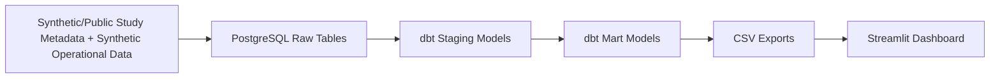

# Architecture

RheumTrialOps uses a simple local analytics architecture designed to be easy to understand, run, and extend.

## Layer Descriptions

### Synthetic Data Generation

`src/generate_data.py` creates synthetic CSV files for studies, subjects, grants, and milestones. The data is rheumatology-themed and includes intentional data quality issues for validation reporting.

### PostgreSQL Raw Tables

The `raw` schema stores CSV-loaded source tables with minimal transformation. The raw layer preserves intentional bad records.

### dbt Staging Models

The `staging` schema standardizes text fields, casts dates and numeric fields, and adds validation flags such as invalid enrollment timelines or missing milestone actual dates.

### dbt Mart Models

The `marts` schema creates dashboard-ready outputs for portfolio reporting, subject accrual, grants/JIT tracking, milestone delays, data quality issues, and study risk scoring.

### CSV Exports

`src/export_marts_to_csv.py` exports mart tables to `outputs/streamlit/` and `outputs/powerbi/` so the dashboard can run without a live database connection.

### Streamlit Dashboard

`app.py` reads only CSV files from `outputs/streamlit/` and presents the operational dashboard.
